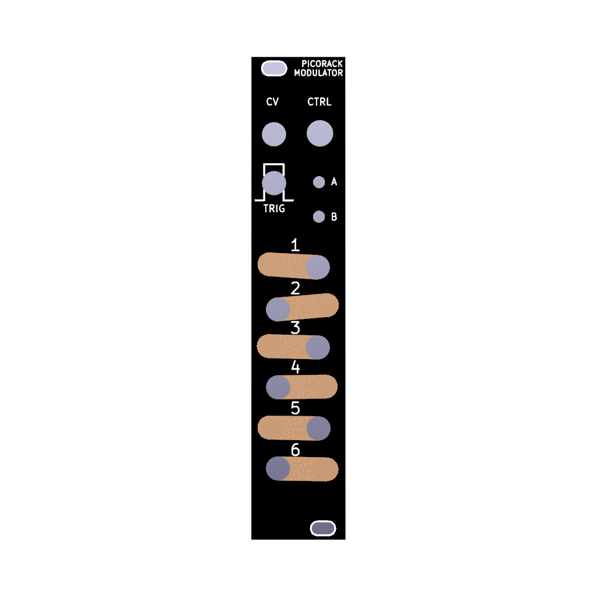

# Hexloffle 

_Hexloffle: 6x tap tempo LFOs in 5HP_

## Overview

_Hexloffle_ provides six tap tempo LFOs, with configurable multipliers/dividers per channel and
multiplier randomization via CV control.

&nbsp;                   |&nbsp;                                    
-------------------------|-------------------------------------
**Width**                | 5HP (25 mm)                                 
**Depth**                | 43 mm                              
**Peak current draw**    | 150mA (+12V), 10mA (-12V), 0mA (+5V) 
**Typical current draw** | 100mA (+12V), 5mA (-12V), 0mA (+5V) 
**Alignment**            | [Chaotic neutral](https://en.wikipedia.org/wiki/Alignment_(Dungeons_%26_Dragons)#Chaotic_neutral)

## Installation

Hexloffle requires a -12V/+12V power supply (standard 2x5 pin Eurorack power connector), and draws ~100mA on the +12V rail under normal operation.

The module has reverse polarity protection on the power socket, but please don't rely on it. Your module should have a notched box socket to prevent connecting the power cable in the wrong orientation. If your module is a hardware variation that does not have a notched box socket, ensure the red stripe on the power cable matches the 'RED' annotation on the PCB (when looking at the back of the module, with the power connector to the top, the red stripe on the ribbon cable (-12V) should be on the right).

## Getting started

Tap `Button A` at a steady tempo, or patch a constant clock or trigger signal into `TRIG`.
Observe that the LEDs are pulsing between red and yellow.

Patch one of the outputs 1-6 into another module in your system - try a filter cutoff input, VCO frequency input or other module where you can easily hear the result of a control voltage change. Enjoy having six synchronized LFOs !

## Controls

The LFO rate follows the tempo of a clock at `TRIG`, or the tempo of `Button A` when tapped.
The LFO is always a sine (or best digital effort).

- `Button A` _(short taps)_: set tempo, LFO rate
- `Button B` _(short press)_: select output to edit
    - Output selection cycles through outputs 1 - 6, then 'all outputs'
    - The selected output flashes **green**
- `Button B` _(hold)_: edits the clock multiplier/divider for the currently select output(s)
    - Hold `Button B`, then turn the `CTRL` potentiometer to modify the multiplier/divider
    - Selected outputs will briefly flash **cyan** when `Button B` is held.
    - Each output has it's own multiplier. 
        There is also a 'global multiplier'. When 'all outputs' are selected, the global multiplier 
        is modified (final output multiplier = channel multiplier * global multiplier)
- `CTRL` - the potentiometer is only used when `Button B` is held.
- `CV` input (0.0 ~ 5.8V): random multiplier
    - At each tap/clock the `CV` input is read. 
    - The `CV` value determines the maximum value for a randomly chosen multiplier 
        applies individually to each output.
    - At input voltages below ~1.0V, some outputs will randomly receive a 2x multiplier, others won't.
    - The maximum random multiplier varies from a sensible 2x - 5x at voltages below 2.5V, to crazy 
        fast multipliers as we get above 2.5V.
    - Approximate multipliers at `CV` voltages: 
        - 1.0V -> x2
        - 1.7V -> x3
        - 2.0V -> x4
        - 2.5V -> x5
        - 3.5V -> x16
        - 4.5V -> x50
        - 5.5V -> x128
        - 5.8V -> x200

The LFO rate of each channel is determined by the clock/tap rate and several multipliers/dividers.
The final rate of an output is: 

`clock rate * global * channel * random(channel)`

Upon power-on, the initial `channel` multiplier's give slow LFOs for the top outputs, 
and increasingly faster LFOs for the lower outputs.

## Inputs and outputs

- `TRIG`: A trigger or clock input to set the speed of the LFOs.
- `CV`: A 0 to 5.8V control voltage input that determines the maximum random multiplier (see above)
- `Outputs 1 - 6` (numbered sockets, from top to bottom): Bipolor control voltage outputs, approximately -5 to +5V.
    - Each output is associated with an RGB LED that displays the amplitude of the output signal.
        **Red** is positive, **yellow** is negative and **blue** is close to zero.
        The LEDs flash other colours (green, cyan) to indicate output selection.

## Firmware updates

Connect a micro USB cable between your computer and the micro USB port on the Raspberry Pi Pico on the back of the Hexaloffle. It ***should*** be safe to do this while the Eurorack power is also connected and on (this is how I've always done firmware updates, via a USB hub), however I make no guarantees this won't somehow damage your equipment. If you want to reduce the risk of damaging your computer / USB port / hub, please disconnect the Eurorack power first - the front panel lights won't function under USB-only power, but the firmware updates work just the same.

Briefly:

- Install [MicroPython on the Raspberry Pi Pico](https://www.raspberrypi.com/documentation/microcontrollers/micropython.html#drag-and-drop-micropython). If MicroPython is already installed, you can probably skip this step.
- Copy the [Hexaloffle source code](https://github.com/semi-sensible-synth/hexaloffle/tree/main/code) files to the Pico (eg using Thonny, `rshell` or similar).